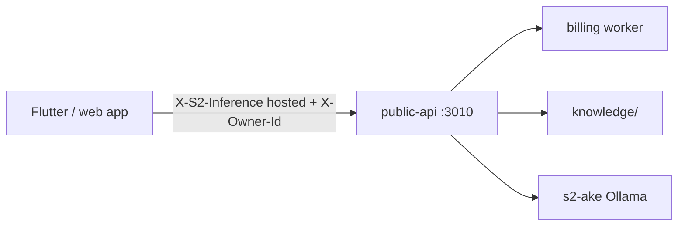

# Hosted S² Assistant (Ake gateway)

Single consumer-facing assistant backed by Ollama model **`s2-ake`**, with server-side prompt assembly and collective-knowledge RAG. Internal synthesizer id is `ake`; product UI uses **S² Assistant** only.

## Architecture



| Path | Headers | Compute |
|------|---------|---------|
| Hosted | `X-S2-Inference: hosted`, `X-Owner-Id`, `X-S2-Product-Id` | Ollama `s2-ake` after billing check |
| BYOK | `X-Groq-Api-Key` | Groq with same templates + RAG |

Apps must **not** call Ollama directly when `USE_HOSTED_GATEWAY=true` (PSLA production default).

**Production inference today:** Ollama **`s2-ake`** only. Unified LoRA (`:8100`) is lab until [docs/TIER_C_RETRAIN_RUNBOOK.md](./docs/TIER_C_RETRAIN_RUNBOOK.md) eval gate passes — see [docs/AKE_LORA_STATUS.md](./docs/AKE_LORA_STATUS.md).

## Phases (implemented)

### Phase 1 — Gateway

- `server.js` routes hosted vs BYOK
- `lib/prompts.js` natural Ake + `legal` / `general` overlays
- `lib/ollama.js`, `lib/billing.js`

### Phase 2 — `s2-ake` model

- `ollama/Modelfile.s2-ake`
- `scripts/create-s2-ake-model.ps1`

### Phase 3 — Collective RAG

- `lib/rag.js` keyword retrieval over `knowledge/`
- Seed: `pro-se-legal-basics.md`, `s2-ecosystem.json`
- Add `.md` / `.json` chunks to grow the index

### Phase 4 — Clients

- PSLA `S2IntelligenceChatService` → gateway only for hosted
- `USE_HOSTED_GATEWAY`, `ALLOW_DIRECT_OLLAMA` dart-defines

## Deploy on r730

```powershell
# On host with Ollama
cd APPs/s2-intelligence-platform/public-api
.\scripts\create-s2-ake-model.ps1

cp .env.example .env
# Edit: OLLAMA_BASE_URL=http://127.0.0.1:11434, LAB_HOSTED_UNLOCK=false, HOSTED_REQUIRE_BILLING=true

npm install
npm start
```

Expose `:3010` via tunnel or reverse proxy as `https://api.s2artslab.com` (or app-specific host).

**Workstation dev:** r730 blocks LAN inference ports by firewall policy. Use [docs/CURSOR_R730_ALIGNMENT.md](./docs/CURSOR_R730_ALIGNMENT.md) and `scripts/start-r730-inference-tunnel.ps1` (forwards `:3020` and `:11434`).

## Environment

| Variable | Purpose |
|----------|---------|
| `OLLAMA_BASE_URL` | Ollama on r730 |
| `OLLAMA_MODEL` | Default `s2-ake` |
| `HOSTED_REQUIRE_BILLING` | `true` in production |
| `LAB_HOSTED_UNLOCK` | `true` for dev without Stripe |
| `BILLING_API_URL` | Entitlement check |
| `S2_KNOWLEDGE_DIR` | RAG corpus path |

## Client contract (thin)

```json
POST /api/public/chat-with-context
{
  "user_message": "...",
  "history": [],
  "context": "legal",
  "jurisdiction": "California",
  "case_context": "...",
  "rag_limit": 5
}
```

Response includes `source`: `hosted-ollama` | `groq-byok`, and `rag_used`.

## Trained LoRA (production path on r730)

Weights: `/mnt/bipra/egregore-training/trained_models/{egregore}/`

**Unified service** (Flask, port **8100**):

```bash
bash scripts/setup-unified-8100-r730.sh   # EGREGORE_DEVICE=cpu on P40
systemctl status unified-egregore
```

**Hosted gateway** (Node, port **3020** on r730 — `3010` is legacy Python API):

```bash
cp scripts/r730-public-api.env /opt/s2-ecosystem/public-api/.env
systemctl enable --now s2-public-api
curl http://127.0.0.1:3020/health
```

Env (production): `HOSTED_PREFER_UNIFIED_LORA=false`, `UNIFIED_EGREGORE_URL=http://127.0.0.1:8100` (lab/benchmarks).

After Tier C: `HOSTED_PREFER_UNIFIED_LORA=true` only when [scripts/tier-c-eval-gate-r730.py](./scripts/tier-c-eval-gate-r730.py) exits 0.

Safe unified mode on P40 (avoids CUDA OOM): `bash scripts/setup-unified-production-r730.sh` — [docs/R730_UNIFIED_MEMORY_PLAN.md](./docs/R730_UNIFIED_MEMORY_PLAN.md).

Optional Ollama merge (`s2-ake-lora` on Llama 3.2) only after **7B** Ake weights exist — see **[docs/LORA_TO_OLLAMA.md](./docs/LORA_TO_OLLAMA.md)**.

## Operations checklist

- [ ] `ollama list` shows `s2-ake` (and `s2-ake-lora` when trained)
- [ ] `GET /health` → `ollama.hasConfiguredModel: true`
- [ ] `GET /api/public/capability` → `rag_available: true`
- [ ] PSLA `S2_API_URL` points at this service
- [ ] Production: `HOSTED_REQUIRE_BILLING=true`, `LAB_HOSTED_UNLOCK=false`

## After r730 training completes

Do not treat hosted chat smoke as pass/fail while GPU training is still running.

1. `systemctl restart unified-egregore` then `s2-public-api` if weights or env changed
2. `curl http://127.0.0.1:3020/health` → `unified_lora.ok` and `hasAke: true`
3. `python3 scripts/test-hosted-chat-r730.py` on r730
4. From dev PC: **`APPs/pro-se-legal/docs/AFTER_R730_TRAINING.md`** (tunnel + `test-s2-hosted-chat.ps1` + PSLA `flutter run`)
5. Confirm chat `source` is `hosted-unified-lora` when `:8100` is preferred; `hosted-ollama` is fallback only
