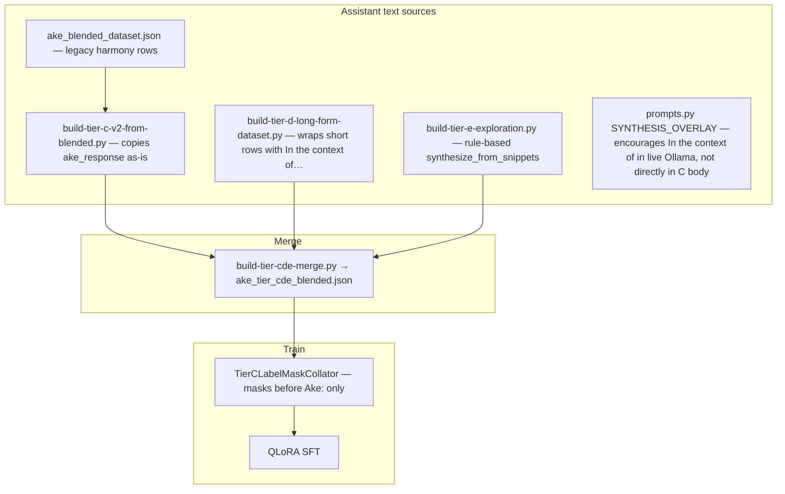

# Ake assistant quality — strip / down-weight bad training text

**Problem:** Label masking stops **prompt echo** (loss only on `Ake:` tokens). It does **not** stop the model from learning bad **completion** habits baked into `ake_response` — especially `In the context of…`, `From a synthesis perspective…`, and Tier E rule-based boilerplate.

**Symptom in lab:** Unified LoRA replies sound canned even at 4-bit CUDA with correct `User question:` / `Ake:` serve format.

---

## Where bad text enters the pipeline



| Source | Mechanism | Fix at source |
|--------|-----------|----------------|
| Tier C blended | Historical `question` / `ake_response` rows | Audit + drop or rewrite |
| Tier D expand | Prepends `In the context of {domain}, {short answer}…` | Change expand template in `build-tier-d-long-form-dataset.py` |
| Tier E | `synthesize_from_snippets()` hard-codes openers | Rewrite generator or human-review all `needs_review` rows |
| Collator | Trains on full bad `ake_response` after `Ake:` | Down-weight or drop before train |

---

## Strategy matrix (recommended order)

### Tier 1 — Data audit & filter (do first)

**Tool:** `scripts/audit-ake-assistant-quality.py` + `scripts/lib/assistant_quality.py`

```bash
# Measure problem size on r730
python3 /opt/s2-ecosystem/public-api/scripts/audit-ake-assistant-quality.py \
  --input /opt/s2-ecosystem/egregore-training/training_data/ake_tier_c_blended.json

# Produce cleaned Tier C for retrain
python3 .../audit-ake-assistant-quality.py \
  --input .../ake_tier_c_blended.json \
  --drop-canned --strip-openers \
  --min-score 0.25 \
  --out .../ake_tier_c_cleaned.json
```

| Action | Effect | Risk |
|--------|--------|------|
| **Drop** rows with canned openers | Removes strongest poison | Smaller dataset |
| **Strip** first boilerplate sentence | Keeps row count | May leave thin or odd text — review samples |
| **min-score** threshold | Soft filter | Tune from audit stats |

Then point merge at cleaned C:

```bash
python3 scripts/build-tier-cde-merge.py \
  --tier-c .../ake_tier_c_cleaned.json \
  ...
```

### Tier 2 — Fix generators (stop re-poisoning)

| File | Change |
|------|--------|
| `build-tier-e-exploration.py` | Replace `synthesize_from_snippets()` with excerpt-grounded drafts or require human edit before merge (`--skip-needs-review` already exists) |
| `build-tier-d-long-form-dataset.py` | Expand from composed/field-message voice, not `In the context of {domain}, {a}` |
| `lib/training_row_utils.py` | Optional: `synthesis=False` default for Tier C rows (drops SYNTHESIS_OVERLAY line that mentions integrative cadence) |
| `build-tier-c-v2-from-blended.py` | Run **after** audit on source blended JSON, not before |

### Tier 3 — Down-weight at train time (without dropping rows)

Extend `TierCLabelMaskCollator` → weighted collator:

1. After building `labels`, compute `assistant_quality.score(row)` (0.0–1.0).
2. For tokens **after** `Ake:`, multiply loss contribution by `score` (HF: custom `Trainer.compute_loss` or sample-level weight via duplicated undersampling).

| score | Meaning |
|-------|---------|
| 1.0 | Keep full loss |
| 0.25 | Canned opener — still learn a little |
| 0.0 | Skip row in collator (`continue` / don't add to batch) |

**Pros:** Keeps row count; soft penalty on borderline rows.  
**Cons:** More code; model may still memorize high-frequency openers if score too high.

### Tier 4 — Phrase-level label mask (surgical)

Within the assistant span only, set `labels = -100` for token ranges matching:

- `In the context of`
- `From a synthesis perspective`
- `several threads converge`

**Pros:** Teaches structure without reinforcing exact opener n-grams.  
**Cons:** Token-boundary fragility; brittle across tokenizers; harder to maintain.

### Tier 5 — Rewrite pass (quality recovery)

For rows flagged but not dropped:

1. **Rule strip** (audit `--strip-openers`) — fast, limited.
2. **Ollama `s2-ake` rewrite** — batch job: "Rewrite in direct Ake voice, same facts, no In the context of opener."
3. **Human** — Tier E already uses `tier_e_human_review.md`.

Store as `ake_tier_c_rewritten.jsonl` with `metadata.rewrite_source`.

### Tier 6 — Preference training (later)

- Holdout set of **good** Ollama or hand-authored replies.
- DPO / ORPO with **rejected** = canned template completions.

Highest quality, highest ops cost — after Tier 1–2 stabilize SFT.

---

## Recommended CDE retrain recipe

1. Audit C → `ake_tier_c_cleaned.json` (drop + strip + min-score).
2. Fix Tier D/E generators (or exclude E until reviewed).
3. Merge → `ake_tier_cde_blended_v2.json`.
4. Train with existing `TIER_C_LABEL_MASK=1` (keep).
5. Optional: pass `metadata.quality_score` into weighted collator v2.
6. Eval gate (now fails `In the context of` openers) + lab UI with Ollama default.

**Do not** promote `HOSTED_PREFER_UNIFIED_LORA=true` until gate passes on **cleaned** weights.

---

## What label masking already solves (do not re-litigate)

| Issue | Label mask |
|-------|------------|
| Echo `User question:` | Fixed |
| Echo system block | Fixed |
| Learn `2: Hello, world!` from prompt | Mostly fixed |
| Canned **assistant** templates | **Not fixed** — needs data or weighted loss |

---

## Related scripts

| Script | Role |
|--------|------|
| `audit-ake-assistant-quality.py` | Measure + filter + optional strip |
| `tier-c-eval-gate-r730.py` | Inference gate (same opener patterns) |
| `build-tier-cde-merge.py` | Merge cleaned tiers |
| `train-ake-tier-cde-r730.sh` | Full retrain pipeline |
