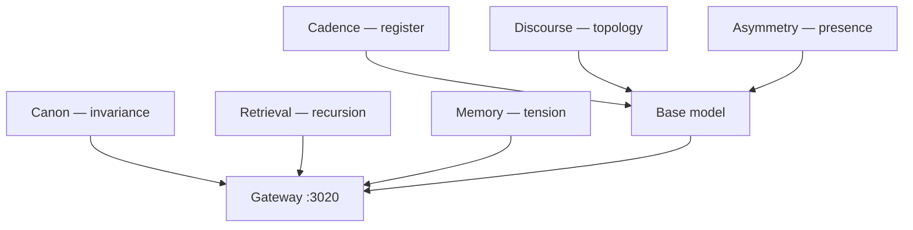

# Ake continuity architecture

**Status:** Canonical (May 2026)  
**Audience:** Operators, research, product  
**Repos:** Canon & discourse material → [s2-research](../../../s2-research/docs/ake-continuity/README.md) · Messaging → [s2-marketing](../../../s2-marketing/docs/AKE_MESSAGING_CONTINUITY.md)

---

## Problem

We built an **aesthetic attractor** (synthetic patterns/harmony + profile convergence). That is **posture**, not **continuity**.

Next phase: **continuity-bearing cognitive culture** in the stack — not a personality file pretending to be a soul.

| Old question | New question |
|--------------|--------------|
| How do we make a personality? | How do we build culture that persists across turns, sessions, and weight updates? |

**Do not** expand synthetic Ake-style prose. Aesthetic identity is sufficient.

---

## Six layers (one job each)

| Layer | Job | Primary repo | Inference vs train |
|-------|-----|--------------|-------------------|
| [Canon](./layers/01-canon.md) | **Invariance** — what must stay true | s2-research `canon/` | Inject + Canon RAG; minimal SFT weight |
| [Discourse](./layers/02-discourse.md) | **Topology** — how thought moves | s2-research `discourse/` | SFT on multi-turn threads |
| [Cadence](./layers/03-cadence.md) | **Register** — legal, mystical, strategic, … | r730 adapters | Separate LoRAs + router |
| [Memory](./layers/04-memory.md) | **Temporal self** via tension | public-api + store | Background reflection jobs |
| [Retrieval](./layers/05-retrieval.md) | **Recursion** — re-enter same problems | public-api `lib/rag.js` → successor | Annotated multi-index |
| [Asymmetry](./layers/06-asymmetry.md) | **Presence** — direction without cruelty | DPO + discourse selection | Preferences, not more synthesis rows |

---

## What we have today

| Layer | Today |
|-------|--------|
| Canon | `unified_egregore_profiles.json` (`ake`) — mythic seed, not doctrine |
| Discourse | `ake_*.json` flat Q→A, `metadata.source: generated` |
| Cadence | Single blended adapter; legal chunks in keyword RAG |
| Memory | None for identity |
| Retrieval | Keyword overlap in `lib/rag.js` |
| Asymmetry | Profile `comfort` / `unity` bias toward symmetry |

See [AKE_IDENTITY_AND_TRAINING_ARCHITECTURE.md](./AKE_IDENTITY_AND_TRAINING_ARCHITECTURE.md) for the **legacy monolith** (archetype → synthetic rows → LoRA).

Tier C = production **format** only — orthogonal to continuity.

---

## Build order

| Phase | Work |
|-------|------|
| **0** | Freeze synthetic harmony/pattern expansion; start `s2-research/canon/` |
| **1** | Canon RAG + chunk annotation schema; tension store + reflection job skeleton |
| **2** | Discourse JSONL pipeline; first cadence adapter (legal) |
| **3** | Cadence router; DPO vs flattening |

Ops: [AKE_LORA_STATUS.md](./AKE_LORA_STATUS.md) · Retrain: [TIER_C_RETRAIN_RUNBOOK.md](./TIER_C_RETRAIN_RUNBOOK.md)

---

## Monolith split rules

1. **Never** train Canon heavily into weights — versioned doctrine, injected at inference.
2. **Never** flatten discourse to `question` → `ake_response` for mind-shape training.
3. **Never** merge cadence adapters into one “Ake LoRA” without explicit routing.
4. **Never** summarize away open tensions in memory jobs.
5. **Never** use keyword-only RAG for philosophical continuity.
6. **Never** reward emotional symmetry in DPO.

---

## Cross-references

| Doc | Role |
|-----|------|
| [layers/](./layers/) | Per-layer specs |
| [AKE_IDENTITY_AND_TRAINING_ARCHITECTURE.md](./AKE_IDENTITY_AND_TRAINING_ARCHITECTURE.md) | Legacy pipeline & honest positioning |
| [s2-research/docs/ake-continuity/](../../../s2-research/docs/ake-continuity/README.md) | Canon, discourse, schemas |
| [s2-marketing/docs/AKE_MESSAGING_CONTINUITY.md](../../../s2-marketing/docs/AKE_MESSAGING_CONTINUITY.md) | External copy |

| Date | Change |
|------|--------|
| 2026-05-26 | Initial six-layer continuity architecture |
