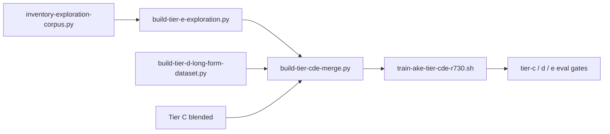

# Ake exploration training corpus (Tier E + CDE merge)

**Goal:** Train on **real Ninefold explorations** — podcasts, `s2-research`, `s2-marketing` docs, solarpunk campaign — merged with Tier C/D so short-prompt quality is preserved.

---

## Pipeline (run order)



### One-shot (dev PC)

```bash
cd APPs/s2-intelligence-platform/public-api
export S2_APPS_ROOT="C:/Users/shast/S2/APPs"   # or /opt/s2-ecosystem on r730

python3 scripts/export-exploration-training-bundle.py \
  --apps-root "$S2_APPS_ROOT" \
  --tier-c /opt/s2-ecosystem/egregore-training/training_data/ake_tier_c_blended.json \
  --out-dir training_data
```

### r730 (full train)

```bash
bash /opt/s2-ecosystem/public-api/scripts/train-ake-tier-cde-r730.sh
```

---

## Scripts

| Script | Output |
|--------|--------|
| `inventory-exploration-corpus.py` | `training_data/exploration_manifest.json` |
| `build-tier-e-exploration.py` | `ake_tier_e_exploration.jsonl` + `tier_e_human_review.md` |
| `build-tier-d-long-form-dataset.py` | `ake_tier_d_long.jsonl` |
| `build-tier-cde-merge.py` | `ake_tier_cde_blended.json` |
| `train-ake-tier-cde-r730.sh` | Weights + eval gates |

---

## Source mix (default merge)

| Bucket | ~Share | Content |
|--------|--------|---------|
| Tier C | 75% | `ake_tier_c_blended.json` — gateway-shaped, short |
| Tier D | 10% | Composed long + optional expansions |
| Tier E | 15% | Podcast synthesis, canon, solarpunk research, marketing voice, Forge RAG |

Use `--skip-needs-review` on merge until podcast syntheses are edited in `tier_e_human_review.md`.

---

## Solarpunk (what gets ingested)

| Path | Use |
|------|-----|
| `ninefold-studio-clean/egregorelab/scripts/create_episode_01_solarpunk.py` | Episode 01 dialogue → Ake synthesis rows |
| `ninefold-studio-clean/egregorelab/podcasts/*.json` | Per-episode synthesis rows |
| `s2-research/SOLARPUNK_TECHNOLOGY_ECOSYSTEM.md` | Section-chunked doctrine rows |
| `s2-research/SOLARPUNK_VR_INTEGRATION_GUIDE.md` | Product/integration (lower SFT weight) |
| `s2forge/web/rag-corpus/solarpunk-community-campaign.md` | IRL campaign tone |
| `s2-research/scripts/export_cmp_solarpunk_evidence.py` | Sharayah feed stub (not LoRA rows) |

---

## Human review (required for podcast rows)

`build-tier-e-exploration.py` writes **`training_data/tier_e_human_review.md`** — rule-based Ake syntheses from podcast segments (`needs_review: true`).

1. Edit bodies in JSONL or re-run after hand-authoring `ake_response` in review doc.  
2. Merge with `--include-needs-review` only after approval.

---

## Eval gates (post-train)

| Gate | Command |
|------|---------|
| Tier C | `tier-c-eval-gate-r730.py` |
| Tier D long | `tier-d-eval-gate-r730.py` |
| Tier E solarpunk | `tier-e-eval-gate-r730.py` |

---

## RAG vs SFT

| Mechanism | Sources |
|-----------|---------|
| **RAG** (`S2_KNOWLEDGE_DIR`, discourse index) | Manifest files, canon, campaign md |
| **SFT** | Merged `ake_tier_cde_blended.json` only |

---

## Operational status (r730)

| Step | Status |
|------|--------|
| Tier E on server | `ake_tier_e_exploration.jsonl` (36 rows in merge; 7 podcast rows held with `--skip-needs-review`) |
| Tier D rebuild | **508** rows from `ake_blended_dataset.json` + composed sections |
| CDE merge | `ake_tier_cde_blended.json` — **12,022** rows (9017 C + 508 D + 36 E) |
| QLoRA train | `nohup` via `venv-vllm-p40-src` — log: `/var/log/s2-ake-tier-cde-train.log` |
| Post-train | `tier-c-eval-gate-r730.py`, `tier-d-eval-gate-r730.py`, `tier-e-eval-gate-r730.py` after train completes |

**Do not** set `HOSTED_PREFER_UNIFIED_LORA=true` until Tier C (+ E) gates pass. Long-form can stay Ollama-first (`HOSTED_LONG_FORM_PREFER_OLLAMA`).

---

## Related

- [AKE_IDENTITY_AND_TRAINING_ARCHITECTURE.md](./AKE_IDENTITY_AND_TRAINING_ARCHITECTURE.md)  
- [AKE_LONG_FORM.md](./AKE_LONG_FORM.md)  
- [TIER_C_RETRAIN_RUNBOOK.md](./TIER_C_RETRAIN_RUNBOOK.md)  
- [s2-research/docs/governed-interface/README.md](../../../s2-research/docs/governed-interface/README.md)  
