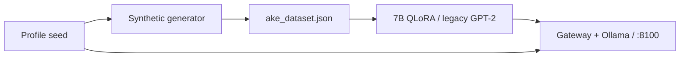

# Ake identity & training architecture (legacy monolith)

**Audience:** Research, product, marketing, operators  
**Status:** Canonical for **what shipped through May 2026**  
**Next phase:** [AKE_CONTINUITY_ARCHITECTURE.md](./AKE_CONTINUITY_ARCHITECTURE.md) — six layers, split monolith

Ops: [AKE_LORA_STATUS.md](./AKE_LORA_STATUS.md) · Retrain: [TIER_C_RETRAIN_RUNBOOK.md](./TIER_C_RETRAIN_RUNBOOK.md)  
Research hub: [s2-research/docs/governed-interface/README.md](../../../s2-research/docs/governed-interface/README.md)  
Messaging: [s2-marketing/docs/AKE_MESSAGING_CONTINUITY.md](../../../s2-marketing/docs/AKE_MESSAGING_CONTINUITY.md)

---

## Summary

**Ake** today is an **interpretive posture**: archetype (deep key / Ninefold) → **generated** Q→A rows → LoRA / prompts → hosted convergence.

> **Mythology first. Procedural examples second. Statistical mind third.**

That yields **voice habit** (attractor basin), not philosophical continuity or memory. Tier C fixed **production format**, not substrate.

---

## Core distinction

| Piece | Role |
|-------|------|
| Archetypal spec | `unified_egregore_profiles.json` — intention, not optimizer input |
| Training rows | `ake_*.json` on r730 — `metadata.source: generated` |
| Inference | Gateway, Modelfile, keyword RAG, Ollama / unified LoRA |

Archetype **shaped generation**; rows **became weights**. Not “trained on collective transcripts.”

---

## Legacy pipeline

| r730 artifact | Role |
|---------------|------|
| `ake_dataset.json` | Original SFT |
| `ake_blended_dataset.json` | Foundation blend |
| `ake_conv_only_dataset.json` | Identity-only |
| `ake_tier_c_blended.json` | Gateway-shaped blocks |

Domains: patterns, harmony, wholeness — flat Q→A. Generator not fully in git; r730 artifacts are source of truth.

---

## Is / is not

| Is | Is not |
|----|--------|
| Designed egregore + language habit | Private chat / legal casework in weights (unless added later) |
| Hosted product voice (gated) | Session memory (without Layer 4 architecture) |
| Stable **posture** | Stable **biography** or consciousness claim |

---

## Ceiling

Synthetic harmony/pattern rows **cannot** carry: real Ninefold discourse, legal dialogue shape, asymmetric dynamics, tension persistence.

**Next work:** [AKE_CONTINUITY_ARCHITECTURE.md](./AKE_CONTINUITY_ARCHITECTURE.md) + [s2-research/docs/ake-continuity/](../../../s2-research/docs/ake-continuity/README.md). **Stop** expanding synthetic prose.

---

## Operators

| Item | Location |
|------|----------|
| Training data | r730 `/opt/s2-ecosystem/egregore-training/training_data/ake_*.json` |
| 7B train | `train_egregore_on_foundation_7b.py` |
| Profile | `ninefold-studio-clean/egregorelab/config/unified_egregore_profiles.json` |
| Gateway | [HOSTED_AKE_GATEWAY.md](../HOSTED_AKE_GATEWAY.md) |

---

## Glossary

| Term | Meaning |
|------|---------|
| Archetypal specification | Profile, Modelfile, gateway copy |
| Procedural expansion | Scripts emitting Q→A rows |
| Statistical mind | Weights encoding habits from rows |
| Attractor basin | Multi-layer convergence to one posture |
| Deep key | S² directional frame Ake serves |

| Date | Change |
|------|--------|
| 2026-05-26 | Initial identity audit |
| 2026-05-26 | Trimmed; superseded for continuity by AKE_CONTINUITY_ARCHITECTURE |
