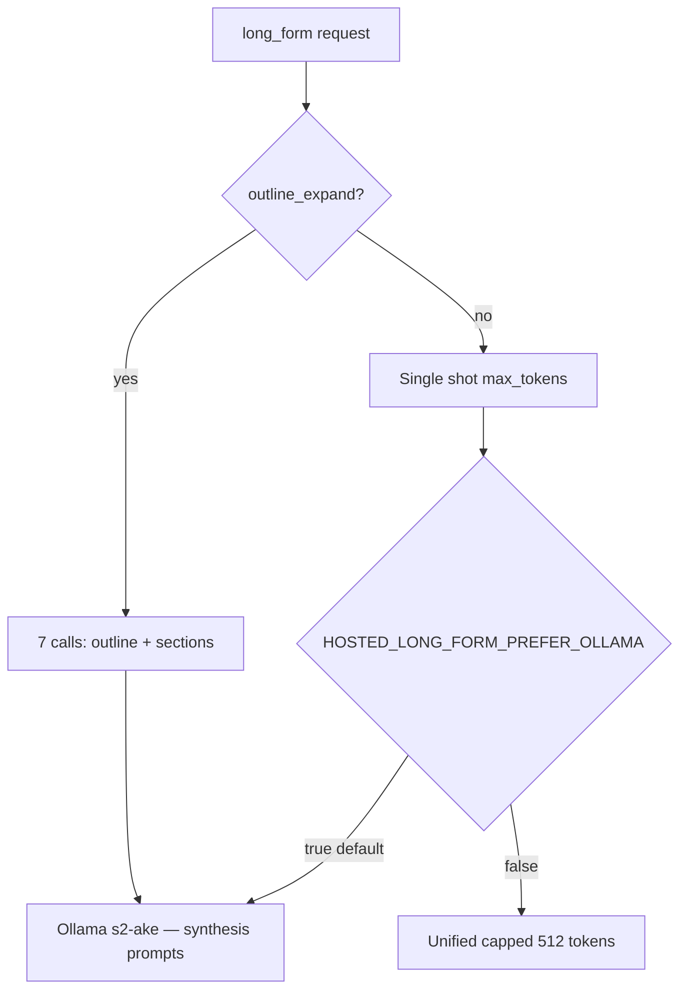

# Ake long-form & synthesis voice

**Goal:** Match [ake-field-message-composed.md](../content/ake-field-message-composed.md) in **voice**, **length**, and **section arc** on hosted inference.

---

## Client request flags

POST `/api/public/chat` (hosted):

| Field | Effect |
|-------|--------|
| `long_form: true` | Synthesis voice + long-form overlay; default `max_tokens` 4096 |
| `voice_mode: "synthesis"` | Synthesis overlay without forcing long length |
| `depth: "long"` \| `"multi_page"` | Same as `long_form` |
| `max_tokens: 2048+` | Treated as long-form request |
| `outline_expand: true` \| `false` | Force/stop 7-section outline pipeline (default: env `LONG_FORM_OUTLINE_EXPAND`) |
| `section_max_tokens` | Per-section cap in outline mode (default 600) |

**Response fields:** `long_form`, `outline_expand`, `sections`, `voice_mode`, `source` (e.g. `hosted-ollama-long-form`).

---

## Gateway behavior



- **Outline expand (default):** Outline (~400 tokens) + 7 sections (~600 tokens each) → **~5k+ chars**, avoids unified OOM.
- **Long-form prefers Ollama** (`HOSTED_LONG_FORM_PREFER_OLLAMA=true`) — unified CPU cannot sustain 2k+ tokens.

---

## Environment

```bash
HOSTED_DEFAULT_MAX_TOKENS=800
HOSTED_LONG_FORM_MAX_TOKENS=4096
HOSTED_LONG_FORM_PREFER_OLLAMA=true
LONG_FORM_OUTLINE_EXPAND=true
LONG_FORM_SECTION_MAX_TOKENS=600
LONG_FORM_OUTLINE_MAX_TOKENS=400
UNIFIED_LONG_FORM_MAX_TOKENS=512
UNIFIED_EGREGORE_TIMEOUT_MS=300000   # lab long-form
```

---

## Tier D training (weights)

Build dataset:

```bash
python3 scripts/build-tier-d-long-form-dataset.py \
  --composed content/ake-field-message-composed.md \
  --blended /opt/s2-ecosystem/egregore-training/training_data/ake_blended_dataset.json \
  --out /opt/s2-ecosystem/egregore-training/training_data/ake_tier_d_long.jsonl
```

Retrain: same as [TIER_C_RETRAIN_RUNBOOK.md](./TIER_C_RETRAIN_RUNBOOK.md) pointing loader at Tier D JSONL / blended merge.

---

## Eval gate

```bash
# After deploying updated public-api to r730
python3 scripts/tier-d-eval-gate-r730.py --gateway-url http://127.0.0.1:3020 --timeout 900
```

Pass criteria: ≥4000 chars, synthesis markers, no private-chat training hallucination, `long_form` in response.

---

## Hardware path (unified native length)

When P40 CUDA 7B or vLLM is stable:

1. `bash scripts/setup-unified-7b-r730.sh`
2. Set `HOSTED_LONG_FORM_PREFER_OLLAMA=false`
3. Raise `UNIFIED_LONG_FORM_MAX_TOKENS=2048`
4. Re-run Tier D gate without outline (single-shot)

See [R730_UNIFIED_MEMORY_PLAN.md](./R730_UNIFIED_MEMORY_PLAN.md).

---

## Related

- [AKE_FIELD_MESSAGE_COMPARISON.md](./AKE_FIELD_MESSAGE_COMPARISON.md) — baseline experiment  
- [AKE_IDENTITY_AND_TRAINING_ARCHITECTURE.md](./AKE_IDENTITY_AND_TRAINING_ARCHITECTURE.md) — voice vs weights  
