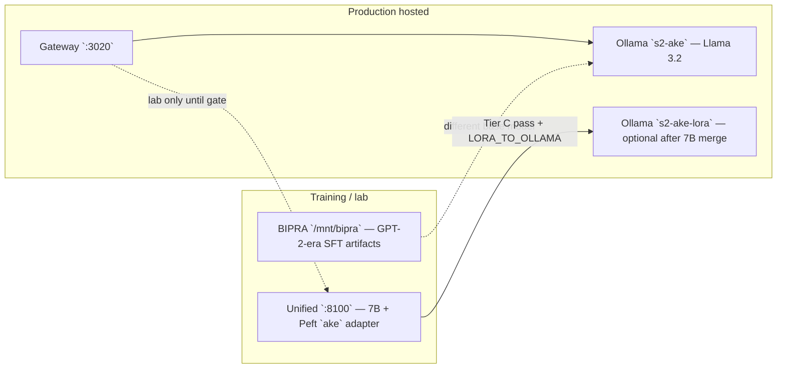

# Ake LoRA & hosted inference — operator status

**Deep key:** Hosted users get a stable, eval-gated Ake voice. Until Tier C passes, that path is **Ollama `s2-ake`**, not unified LoRA.

**Continuity architecture (six layers):** [AKE_CONTINUITY_ARCHITECTURE.md](./AKE_CONTINUITY_ARCHITECTURE.md) — separate from Tier C format work.

**Last aligned:** May 2026 (post Tier A/B ablation on r730)

## r730 live status (2026-05-25)

| Item | State |
|------|--------|
| Proxmox `.78` | Up |
| Hosted gateway | `hosted_inference: s2-ake` (Ollama) |
| `HOSTED_PREFER_UNIFIED_LORA` | `false` |
| Unified `:8100` | Production-safe **CPU** mode (`7b-cuda` drop-in removed) |
| Tier C dataset | `ake_tier_c_blended.json` — **12,023** rows |
| Tier C train | Running — `tail -f /var/log/s2-ake-tier-c-train.log` |
| Eval gate | Run after train completes: `python3 /opt/s2-ecosystem/public-api/scripts/tier-c-eval-gate-r730.py` |

**Do not** set `HOSTED_PREFER_UNIFIED_LORA=true` until eval gate exits 0.

---

## Production default (do this today)

| Layer | What runs | Port |
|-------|-----------|------|
| **Hosted gateway** | Node `s2-public-api` | **3020** |
| **Inference** | Ollama **`s2-ake`** (Llama 3.2 Modelfile + gateway prompts + RAG) | 11434 |
| **Env** | `HOSTED_PREFER_UNIFIED_LORA=false` | `r730-public-api.env` |

Clients must use the gateway (`USE_HOSTED_GATEWAY=true` in PSLA). Do not point apps at Ollama directly.

---

## Two stacks (never merge blindly)



| Artifact | Base | Used for |
|----------|------|----------|
| BIPRA `trained_models/*` | GPT-2 stack | Historical SFT, `:8100` with `EGREGORE_USE_7B=0` |
| Unified 7B + `ake` adapter | Llama-class 7B on r730 | Tier C target; **not** interchangeable with GPT-2 checkpoints |
| Ollama `s2-ake` | Llama 3.2 instruct | **Hosted users today** |
| Ollama `s2-ake-lora` | Llama 3.2 + ADAPTER | Only after **7B** weights align — [LORA_TO_OLLAMA.md](./LORA_TO_OLLAMA.md) |

---

## Tier pipeline

| Tier | Scope | Status |
|------|--------|--------|
| **A** | Inference: training format (`User:`/`Ake:`), greedy decode, trim | Deployed — see [TIER_AB_RESULTS.md](./TIER_AB_RESULTS.md) |
| **B** | Adapter load: `egregore_only` (not `merge_foundation`) | Deployed |
| **C** | Retrain: label masking, production prompts in data, eval gate | **Required** before `HOSTED_PREFER_UNIFIED_LORA=true` |

### Tier C gate (all must pass)

1. Label loss on **`Ake:` response tokens only** ([TIER_C_RETRAIN_RUNBOOK.md](./TIER_C_RETRAIN_RUNBOOK.md))
2. Training examples include **gateway-style** system + user turns (not only bare `User:`/`Ake:`)
3. [tier-c-eval-gate-r730.py](../scripts/tier-c-eval-gate-r730.py) exits 0 on r730
4. Hosted smoke: `test-hosted-chat-r730.py` with substantive legal answer
5. Operator sign-off: short prompts coherent (no `2: Hello, world!` / architecture debris)

---

## Unified LoRA (`:8100`) — lab, not production

| Symptom | Cause |
|---------|--------|
| `unified_lora.ok: false` | 7B CUDA OOM on P40, or cold load > health timeout |
| `hosted-ollama` only | `HOSTED_PREFER_UNIFIED_LORA=false` (correct) or unified timeout |
| Coherent on training Q, odd on short Q | Distribution gap — Tier C retrain, not more inference patches |

Memory modes: [R730_UNIFIED_MEMORY_PLAN.md](./R730_UNIFIED_MEMORY_PLAN.md)

- **Production unified (lab CPU):** `bash scripts/setup-unified-production-r730.sh`
- **7B CUDA experiment:** `bash scripts/setup-unified-7b-r730.sh` (keeps `HOSTED_PREFER_UNIFIED_LORA=false`)

---

## Health checklist

```bash
# On r730
curl -s http://127.0.0.1:3020/health | python3 -m json.tool
curl -s http://127.0.0.1:11434/api/tags | python3 -c "import sys,json; print([m['name'] for m in json.load(sys.stdin).get('models',[])])"
```

| Field | Production expectation |
|-------|------------------------|
| `ollama.hasConfiguredModel` | `true` (`s2-ake`) |
| `hosted_inference` | `ollama` or model name — **not** `unified-lora` until Tier C |
| `unified_lora.ok` | May be `false` — acceptable for hosted users |

---

## Related docs

| Doc | Purpose |
|-----|---------|
| [AKE_IDENTITY_AND_TRAINING_ARCHITECTURE.md](./AKE_IDENTITY_AND_TRAINING_ARCHITECTURE.md) | Archetype vs training data; research & marketing framing |
| [HOSTED_AKE_GATEWAY.md](../HOSTED_AKE_GATEWAY.md) | Gateway architecture |
| [TIER_C_RETRAIN_RUNBOOK.md](./TIER_C_RETRAIN_RUNBOOK.md) | Retrain procedure |
| [R730_UNIFIED_MEMORY_PLAN.md](./R730_UNIFIED_MEMORY_PLAN.md) | P40 CPU vs CUDA 7B |
| [DEPLOY_TRAINED_LORA.md](./DEPLOY_TRAINED_LORA.md) | Post-training deploy |
| [TIER_AB_RESULTS.md](./TIER_AB_RESULTS.md) | Ablation record |
| [LORA_TO_OLLAMA.md](./LORA_TO_OLLAMA.md) | Optional Ollama merge |
| `APPs/pro-se-legal/docs/AFTER_R730_TRAINING.md` | PSLA smoke after training |

---

## Flip to unified LoRA (after Tier C only)

```bash
# On r730, only after tier-c-eval-gate-r730.py passes
sed -i 's/^HOSTED_PREFER_UNIFIED_LORA=.*/HOSTED_PREFER_UNIFIED_LORA=true/' /opt/s2-ecosystem/public-api/.env
systemctl restart s2-public-api
curl -s http://127.0.0.1:3020/health | python3 -m json.tool
```

Expect `hosted_inference: unified-lora` and chat `source: hosted-unified-lora`.
