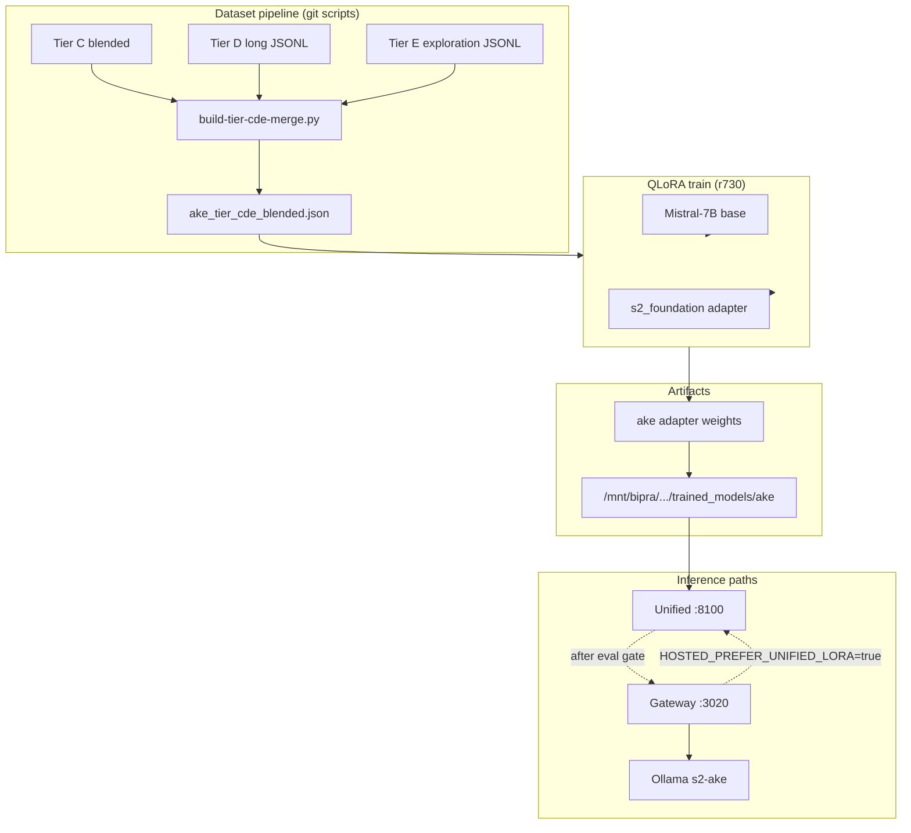

# How the S² Ake QLoRA training system operates

**Audience:** Operators, researchers, anyone wiring datasets or judging when hosted LoRA is safe  
**Host:** r730 (Proxmox `192.168.1.78`) — training and weights live on-server; `public-api` in git holds builders, collators, and eval gates  
**Status:** Canonical for the **7B foundation + Ake adapter** path (May 2026)

Related: [AKE_LORA_STATUS.md](./AKE_LORA_STATUS.md) · [TIER_C_RETRAIN_RUNBOOK.md](./TIER_C_RETRAIN_RUNBOOK.md) · [AKE_EXPLORATION_CORPUS.md](./AKE_EXPLORATION_CORPUS.md) · [AKE_IDENTITY_AND_TRAINING_ARCHITECTURE.md](./AKE_IDENTITY_AND_TRAINING_ARCHITECTURE.md)

---

## What this system is for

The QLoRA training system updates **only the Ake LoRA adapter** on top of a frozen **Mistral-7B** base and an existing **S² foundation** adapter. It does not retrain the full 7B model, does not replace Ollama’s base Llama weights, and does not ingest private user chats unless you explicitly add them to a dataset tier.

The goal is **train/serve alignment**: weights should see the same turn shape the hosted gateway and unified `:8100` service use at inference time—system block, `User question:`, `Ake:` completion—so short legal prompts stay coherent and long synthesis voice can be learned without destroying short-answer quality.

Production hosted users still run **Ollama `s2-ake`** until eval gates pass; training improves the **lab/production-optional** unified LoRA path first.

---

## Two worlds: training stack vs hosted stack

Do not confuse these—they share the name “Ake” but not always the same base model.

| World | Base model | What gets updated | Where it runs |
|-------|------------|-------------------|---------------|
| **QLoRA training (this doc)** | `mistralai/Mistral-7B-v0.1` + `s2_foundation` LoRA | New **`ake`** LoRA weights | r730 GPU (`venv-vllm-p40-src`) |
| **Hosted production today** | Ollama **Llama 3.2** (`s2-ake` Modelfile) | Prompts + RAG only (no weight change from this pipeline) | Gateway `:3020` → Ollama `:11434` |
| **Legacy BIPRA** | GPT-2-era checkpoints | Historical SFT artifacts | `/mnt/bipra/...` — **not** interchangeable with 7B Ollama merge |

After a successful 7B train, optional export to Ollama is a **separate** step ([LORA_TO_OLLAMA.md](./LORA_TO_OLLAMA.md)). Until then, QLoRA output is consumed by **unified egregore** on `:8100`.



---

## QLoRA in one paragraph

**LoRA** (Low-Rank Adaptation) trains small matrices injected into attention layers while the bulk of the model stays frozen—cheap and reversible compared to full fine-tuning.

**QLoRA** loads the base model in **quantized** form (4-bit-style) so a 7B model fits on a **Tesla P40** (24 GB), then trains the LoRA adapters in higher precision. On r730 the entrypoint is:

```bash
/opt/s2-ecosystem/venv-vllm-p40-src/bin/python \
  /opt/s2-ecosystem/egregore-training/train_egregore_on_foundation_7b.py ake --qlora
```

Environment variables select the merged dataset and collator behavior (see below). Typical run: on the order of **~1,500 steps** and **many hours** on P40 for a full CDE blend (~12k rows).

**Not QLoRA:** changing `lib/prompts.js`, gateway long-form outline expand, RAG retrieval, or Ollama Modelfile text—these steer behavior at **inference** without updating adapter weights.

---

## Model stack during training

Training is **egregore-on-foundation**, not from scratch:

1. Load **Mistral-7B-v0.1** (quantized for QLoRA).
2. Load **S² foundation** adapter from `/mnt/bipra/egregore-training/trained_models/s2_foundation` (organization-wide knowledge already baked in).
3. Attach and train the **Ake** egregore LoRA; write checkpoints to `/mnt/bipra/egregore-training/trained_models/ake`.

At inference, Tier A/B ablation showed **`egregore_only`** load mode is correct: load foundation + Ake adapter graph as trained, not a destructive `merge_foundation` into base weights ([TIER_AB_RESULTS.md](./TIER_AB_RESULTS.md)).

Trainable parameter count is a small fraction of total weights (on the order of **0.2%** trainable)—the log line `trainable params: 13,631,488 || all params: 7,268,995,072` is expected.

---

## Data tiers: C, D, E, and CDE merge

Training data is staged in **tiers** so you can fix production format (C), add length (D), and add real Ninefold corpus (E) without betting everything on one bucket.

| Tier | File(s) | Role | Typical size |
|------|---------|------|----------------|
| **C** | `ake_tier_c_blended.json` | Gateway-shaped short turns; legal + general; production system text from `lib/prompts.js` | ~12k rows |
| **D** | `ake_tier_d_long.jsonl` | Long-form / synthesis voice: composed essay sections + expanded short rows from legacy blended | ~500 rows |
| **E** | `ake_tier_e_exploration.jsonl` | Podcast syntheses, solarpunk research, canon, marketing tone, Forge RAG chunks | ~40–50 rows (grows with corpus) |

**CDE merge** (`build-tier-cde-merge.py`) samples to approximate **75% C / 10% D / 15% E** by row count, shuffles, and writes `ake_tier_cde_blended.json`—the file the trainer reads when `TIER_C_BLENDED` is set.

Flags that matter:

- `--skip-needs-review` — excludes Tier E podcast rows flagged `metadata.needs_review: true` until a human edits `tier_e_human_review.md`.
- `--tier-c-ratio` / `--tier-d-ratio` / `--tier-e-ratio` — override default mix.

Tier E is built from an **inventory** of APPs paths (`inventory-exploration-corpus.py` → `exploration_manifest.json`), then `build-tier-e-exploration.py`. Podcast dialogue is **not** copied verbatim; rule-based **Ake synthesis** rows are produced so the model does not learn multi-speaker transcript format.

---

## Row shape: from JSON to training string

Builders in `scripts/lib/training_row_utils.py` share the same system overlays as the gateway (AKE core, legal/general overlay, optional synthesis overlay).

Each training row carries at minimum:

- `system` — full system block (may include RAG-style reference wrappers on legal rows)
- `user` — user question
- `assistant` / `ake_response` — completion body
- `question` — pre-serialized gateway prompt: `{system}\n\n---\n\nUser question:\n{user}`

The trainer converts each row to one text sample:

```text
{system_block}

---

User question:
{user}

Ake: {assistant}
```

Literal prefixes **`User question:`** and **`Ake:`** must match [unified-lora.js](../lib/unified-lora.js) and hosted embedding paths. Deviating causes a **distribution gap** (model coherent on training-format prompts, broken on short gateway prompts).

Blended JSON for historical compatibility stores `question` + `ake_response`; Tier C/D/E JSONL can store structured fields—the collator formats either.

---

## Label masking (Tier C mechanism, used for CDE)

Standard causal LM training would put loss on the **entire** sequence—including system and user tokens—which teaches the model to **echo prompts** (`User:`, debris, fake numbered lists).

**Tier C fix:** loss only on tokens **after** `Ake:`.

Implementation: `TierCLabelMaskCollator` (`scripts/tier-c-label-mask-collator.py`), enabled when:

```bash
export TIER_C_LABEL_MASK=1
```

On r730 the collator is wired into `train_egregore_on_foundation_7b.py` via patches applied by `train-ake-tier-c-r730.sh` (dataset path override + collator + skip eager tokenize when masking).

**Do not** use `DataCollatorForLanguageModeling` without masking for Ake Tier C/CDE runs.

---

## End-to-end operator pipeline

### On a dev PC (dataset only)

```bash
cd APPs/s2-intelligence-platform/public-api
export S2_APPS_ROOT="C:/Users/shast/S2/APPs"   # or /opt/s2-ecosystem on r730

python3 scripts/inventory-exploration-corpus.py --apps-root "$S2_APPS_ROOT" ...
python3 scripts/build-tier-e-exploration.py --apps-root "$S2_APPS_ROOT" ...
python3 scripts/build-tier-d-long-form-dataset.py \
  --composed content/ake-field-message-composed.md \
  --blended /path/to/ake_blended_dataset.json ...
```

Or one-shot: `scripts/export-exploration-training-bundle.py` (requires `--tier-c` path for merge).

Sync to r730: `scripts/sync-public-api-to-r730.ps1`.

### On r730 (full train)

```bash
bash /opt/s2-ecosystem/public-api/scripts/train-ake-tier-cde-r730.sh
```

Stages inside that script:

1. Inventory exploration corpus  
2. Build Tier E JSONL + human review pack  
3. Build Tier D if missing (needs `ake_blended_dataset.json` on server)  
4. Merge C+D+E → `ake_tier_cde_blended.json`  
5. QLoRA train via `venv-vllm-p40-src` → log `/var/log/s2-ake-tier-cde-train.log`  
6. Restart `unified-egregore`; run tier C/D/E eval gates  

**Before train:** back up existing adapter, e.g. copy `/mnt/bipra/.../trained_models/ake` to `ake_backup_pre_cde`.

**Critical:** use the P40 venv Python—not system `python3` (system Python lacks `peft` and will fail immediately).

Dataset override:

```bash
export TIER_C_BLENDED=/opt/s2-ecosystem/egregore-training/training_data/ake_tier_cde_blended.json
export TIER_C_LABEL_MASK=1
```

---

## Paths and services (r730)

| Item | Path / service |
|------|----------------|
| Training tree | `/opt/s2-ecosystem/egregore-training/` |
| Training data | `.../training_data/ake_*.json`, `ake_tier_*.jsonl` |
| Weights (canonical) | `/mnt/bipra/egregore-training/trained_models/ake` |
| Python env | `/opt/s2-ecosystem/venv-vllm-p40-src` |
| Unified inference | `unified-egregore` → `http://127.0.0.1:8100` |
| Hosted gateway | `s2-public-api` → `http://127.0.0.1:3020` |
| Ollama | `http://127.0.0.1:11434`, model `s2-ake` |

While QLoRA holds the GPU, unified CUDA mode may OOM; production unified is often **CPU lab mode** ([R730_UNIFIED_MEMORY_PLAN.md](./R730_UNIFIED_MEMORY_PLAN.md)). Training and heavy unified CUDA should not be assumed concurrent.

---

## After training: deploy and promote

1. **Load new weights** — `setup-unified-production-r730.sh` or production script; confirm `ADAPTERS_BASE` points at `/mnt/bipra/egregore-training/trained_models`.
2. **Eval gates (must pass before promoting hosted LoRA):**

   | Gate | Script | What it checks |
   |------|--------|----------------|
   | Tier C | `tier-c-eval-gate-r730.py` | Short prompts, no debris, training-format coherence, optional gateway smoke |
   | Tier D | `tier-d-eval-gate-r730.py` | Long-form / synthesis length and voice |
   | Tier E | `tier-e-eval-gate-r730.py` | Solarpunk / exploration keywords and tone |

3. **Promote only if gates exit 0:**

   ```bash
   # In /opt/s2-ecosystem/public-api/.env
   HOSTED_PREFER_UNIFIED_LORA=true
   systemctl restart s2-public-api
   ```

4. **Rollback** — set `HOSTED_PREFER_UNIFIED_LORA=false`, restore backup adapter, restart `unified-egregore` and gateway ([TIER_C_RETRAIN_RUNBOOK.md](./TIER_C_RETRAIN_RUNBOOK.md) §7).

---

## SFT vs RAG vs gateway long-form

| Mechanism | Updates weights? | Purpose |
|-----------|------------------|---------|
| **QLoRA SFT (CDE)** | Yes | Stable voice habit, format, domain tone in weights |
| **RAG** (`S2_KNOWLEDGE_DIR`, discourse index) | No | Fresh facts, canon, campaign docs at query time |
| **Gateway prompts** (`lib/prompts.js`, synthesis/long-form overlays) | No | Steer live responses; outline-expand for length on Ollama |
| **Ollama Modelfile** | No (unless separate merge) | Production default persona |

Long-form quality for end users can be **good enough** from gateway + Ollama without retrain; Tier D exists so the **adapter** also sees sustained essay targets when you want unified LoRA to match.

---

## What the system does not claim

- **Not** training on private chat logs or full podcast transcripts unless you add and review them.
- **Not** philosophical continuity or memory—that is [AKE_CONTINUITY_ARCHITECTURE.md](./AKE_CONTINUITY_ARCHITECTURE.md) (layers above SFT).
- **Not** replacing the archetype JSON profile; synthetic and corpus rows **shape** the statistical mind, the profile **shapes** generation and product intent ([AKE_IDENTITY_AND_TRAINING_ARCHITECTURE.md](./AKE_IDENTITY_AND_TRAINING_ARCHITECTURE.md)).

> Mythology first. Procedural examples second. Statistical mind third.

---

## Tier pipeline context (A → C → CDE)

| Tier | Layer | Training? |
|------|--------|-----------|
| **A** | Inference formatting (greedy decode, trim, training-style prompts) | No — deployed patches |
| **B** | Adapter load graph (`egregore_only`) | No — deployed config |
| **C** | Retrain on gateway-shaped data + label masking | Yes — QLoRA |
| **D** | Long-form dataset + eval | Yes — merged into CDE |
| **E** | Exploration corpus + eval | Yes — merged into CDE |

Training without Tier A/B inference fixes was insufficient; training **with** C/D/E is the current standard path for the next adapter generation.

---

## Quick troubleshooting

| Symptom | Likely cause | Fix |
|---------|--------------|-----|
| `ModuleNotFoundError: peft` | Wrong Python | Use `venv-vllm-p40-src/bin/python` |
| Tier D only 8 rows in merge | Stale small JSONL overwrote full build | Re-run `build-tier-d-long-form-dataset.py` with `--blended ake_blended_dataset.json` |
| Echoes `User:` / list debris | No label mask | `TIER_C_LABEL_MASK=1` + collator |
| Short prompts bad after train | Trained on bare Q/A only | Rebuild Tier C; check serialization |
| Unified OOM | CUDA 7B on P40 during load | CPU production mode; wait for train to finish |
| Hosted still Ollama | By design | `HOSTED_PREFER_UNIFIED_LORA=false` until eval gate |

---

## Script reference

| Script | Function |
|--------|----------|
| `inventory-exploration-corpus.py` | Manifest of ingestible APPs files |
| `build-tier-e-exploration.py` | Tier E JSONL + review markdown |
| `build-tier-d-long-form-dataset.py` | Tier D JSONL |
| `build-tier-cde-merge.py` | Merged training JSON |
| `train-ake-tier-cde-r730.sh` | Full r730 pipeline |
| `train-ake-tier-c-r730.sh` | Tier C only + trainer patches |
| `tier-c-label-mask-collator.py` | Loss mask collator |
| `tier-*-eval-gate-r730.py` | Post-train promotion gates |
| `sync-public-api-to-r730.ps1` | Push git scripts/docs to server |

---

## Related reading

- [AKE_EXPLORATION_CORPUS.md](./AKE_EXPLORATION_CORPUS.md) — Tier E sources and merge policy  
- [AKE_LONG_FORM.md](./AKE_LONG_FORM.md) — Gateway long-form vs Tier D  
- [DEPLOY_TRAINED_LORA.md](./DEPLOY_TRAINED_LORA.md) — `:8100` and `:3020` after weights land  
- [AKE_LORA_STATUS.md](./AKE_LORA_STATUS.md) — live production vs lab flags  
