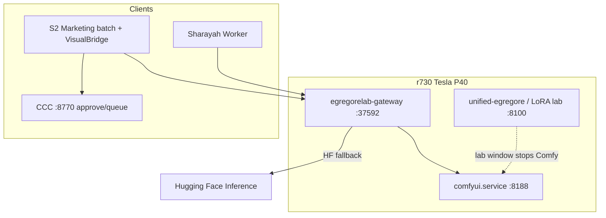

# Local media pipeline (r730 + EgregoreLab)

**Deep key:** Own inference on the P40 — ComfyUI for image/video, Hugging Face only as BYOK or hosted fallback. CCC reviews; it does not generate.

**Canonical implementation:** `APPs/ninefold-studio-clean/egregorelab/`  
**Operator host:** Proxmox r730 `192.168.1.78`

---

## Architecture



| Service | Port | Role |
|---------|------|------|
| ComfyUI | 8188 | Local FLUX/SDXL images, **SVD img2vid** video |
| EgregoreLab gateway | 37592 | `/image/generate`, `/infographic/generate`, `/video/generate` |
| CCC | 8770 | Approve TikTok assets, schedule posts (no generation) |
| public-api | 3010 | Text brain (Ake); stops Comfy during LoRA window |

Tunnel: `https://egregorelab.s2artslab.com` → `:37592`

---

## Image pipeline

| Tier | Backend |
|------|---------|
| 1 | ComfyUI FLUX Schnell / SDXL (`/mnt/s2-data/comfyui-models/checkpoints/`) |
| 2 | HF `FLUX.1-schnell`, SDXL, SD3 |
| 3 | PIL infographic |

Code: `egregorelab/services/media/hq_image_pipeline.py`

---

## Infographic slides (composite layout)

**Route:** `POST /egregorelab/v1/infographic/generate`  
**Code:** `egregorelab/services/media/slide_infographic_pipeline.py`

One **1080×1920 PNG** per request: headline, optional Comfy/HF hero inset, body lines, brand footer. Not the same as TikTok caption overlays.

**Marketing batch:**

```powershell
.\scripts\Start-EgregoreLabTunnel.ps1
python generate_daily_batch.py --account ninefold --count 1 --format infographic_slides
python generate_daily_batch.py --account ninefold --count 1 --format infographic_carousel
python generate_daily_batch.py --account ninefold --count 1 --format both
```

Carousel PNGs: `S2 Marketing Automation/content/generated/carousels/<brand>/`

---

## Video pipeline (first-class local)

| Tier | Backend |
|------|---------|
| 1 | **ComfyUI SVD img2vid** — requires hero PNG + `svd_xt.safetensors` on disk |
| 2 | HF `stable-video-diffusion-img2vid-xt` |
| 3 | HF `Wan-AI/Wan2.1-T2V-1.3B` |
| 4 | Hero image + Ken Burns (FFmpeg) |

Code: `hq_video_pipeline.py` → `comfy_workflows.run_svd_img2vid()`  
Workflow nodes: `ImageOnlyCheckpointLoader`, `SVD_img2vid_Conditioning`, `SaveAnimatedWEBP`  
Reference: `egregorelab/workflows/comfy/svd_img2vid_xt_api.json`

### Install SVD weights (r730)

```bash
bash /root/ninefold-studio-clean/scripts/r730-download-comfy-svd.sh
systemctl restart comfyui.service
```

### Smoke test

```bash
bash /root/ninefold-studio-clean/egregorelab/scripts/r730-media-inventory.sh
bash /root/ninefold-studio-clean/egregorelab/scripts/smoke-comfy-svd-r730.sh
```

### API example

```bash
curl -s -X POST http://127.0.0.1:37592/egregorelab/v1/video/generate \
  -H "Content-Type: application/json" \
  -d '{"content":"gentle motion, symbolic","title":"smoke","duration":5,"hero_image_path":"/path/hero.png"}'
```

Expect `"source": "comfy-svd"` when Comfy + weights are healthy.

---

## Agentic slide video pipeline

Multi-agent production for slide/carousel/storyboard prompts (Strategic Dashboard, Allies, content-package).

**Flow:** Prompt → Creative Brief → Agent Plan → Draft Assets → Ethics → Compose → Review → Publish Package → Human Approval

| Endpoint | Use |
|----------|-----|
| `POST /egregorelab/v1/video/generate` | Auto-routes to agentic when prompt mentions slides/storyboard/etc. |
| `POST /egregorelab/v1/video/generate-agentic` | Force agentic |
| `POST /egregorelab/v1/video/generate-agentic-async` | Long renders; poll `GET /egregorelab/v1/jobs/{jobId}` |

Code: `agentic_video_pipeline.py`, `slide_video_composer.py`, `llm_client.py`

### Smoke test (r730)

```bash
bash /root/ninefold-studio-clean/scripts/r730-gateway-restart.sh
bash /root/ninefold-studio-clean/egregorelab/scripts/smoke-agentic-video-r730.sh
```

### API example

```bash
curl -s -X POST http://127.0.0.1:37592/egregorelab/v1/video/generate-agentic \
  -H "Content-Type: application/json" \
  -H "X-Groq-Api-Key: $GROQ_API_KEY" \
  -d '{"content":"Create a 3-slide video about ethical image generation for S²","slideCount":3,"platform":"tiktok"}'
```

Response includes `publish_package`, `agent_trace`, `ready_for_approval: true`.

Set `GROQ_API_KEY` in `egregorelab/.env` on r730 for LLM planning (fallback works without it).

---

## GPU scheduling (shared P40)

Comfy Flux (~12 GB), SVD I2V, and Ake LoRA **cannot all run at once**.

| Workload | Script |
|----------|--------|
| Pause Comfy for LoRA lab | `public-api/scripts/lab-lora-window-on-r730.sh` |
| Restore Comfy | `lab-lora-window-off-r730.sh` |
| Status | `lab-lora-window-status-r730.sh` |

See [LAB_LORA_WINDOW.md](./LAB_LORA_WINDOW.md).

---

## Marketing Automation + CCC

1. `generate_daily_batch.py` → **VisualBridge** → EgregoreLab gateway  
2. `sync_generated_to_r730.py` → CCC **Review & approve**  
3. CCC queues posts (`content_ref` only in scheduler store)

Env for batch:

```bash
export EGREGORELAB_API_URL=http://192.168.1.78:37592
export S2_NINEFOLD_STUDIO_ROOT=C:/Users/shast/S2/APPs/ninefold-studio-clean
# optional BYOK:
export HUGGINGFACE_API_KEY=hf_...
```

Bridge module: `S2 Marketing Automation/core/egregorelab_visual_bridge.py`

---

## Visual Commons (provenance & training gate)

Image/video **inference** uses open weights on r730. Any **LoRA or fine-tune** must pull pixels only from the governed registry:

| Item | Location |
|------|----------|
| Governance & tiers | `ninefold-studio-clean/docs/VISUAL_COMMONS_GOVERNANCE.md` |
| Canon law | `s2-research/canon/interpretive-laws/visual-commons-provenance.md` |
| Registry (seed) | `egregorelab/data/visual_commons/registry.seed.jsonl` |
| Validate | `python egregorelab/scripts/visual-commons-validate-registry.py` |
| r730 registry path | `/mnt/s2-data/visual-commons/registry.jsonl` |

Tier 1 reference metadata (Wikimedia, NASA, LoC, etc.) informs prompts only unless registered with explicit training consent.

---

## Related docs

| Doc | Location |
|-----|----------|
| Media BYOK routing | `ninefold-studio-clean/docs/MEDIA_BYOK_AND_ROUTING.md` |
| Visual Commons governance | `ninefold-studio-clean/docs/VISUAL_COMMONS_GOVERNANCE.md` |
| Pipeline troubleshooting | `ninefold-studio-clean/egregorelab/docs/PIPELINE_TROUBLESHOOTING.md` |
| Video workflow roadmap | `ninefold-studio-clean/docs/LOCAL_VIDEO_WORKFLOW_ROADMAP.md` |
| Visual intelligence (line art) | `S2 Ecosystem Minimal/.../S2_ECOSYSTEM_VISUAL_INTELLIGENCE_ROADMAP.md` |
| CCC vs studio | `S2 Marketing Automation/s2-marketing/docs/TIKTOK_STUDIO_VS_CCC.md` |

---

## r730 ops gotchas (post-training)

After LoRA training, free the P40 before Comfy video:

```bash
# One command (recommended after training):
bash /root/ninefold-studio-clean/scripts/r730-media-mode-on.sh

# Or step-by-step:
pkill -f train_egregore_on_llama32 || true
systemctl stop ollama.service
bash /root/ninefold-studio-clean/scripts/r730-gpu-media-mode.sh
bash /root/ninefold-studio-clean/egregorelab/scripts/gateway-video-smoke-r730.sh
```

**Wraith process guardian** restarts `comfyui.service` during long SVD runs (high CPU). For media windows:

```bash
systemctl mask wraith-process-guardian.service wraith-process-guardian.timer
```

**Idle power management** stops Comfy after ~20 min idle. Inhibit or disable while producing:

```bash
echo $(($(date +%s)+86400)) > /var/lib/s2-power/inhibit
sed -i 's/^ENABLED=1/ENABLED=0/' /etc/s2-idle-shutdown.conf
systemctl disable --now s2-idle-services.timer s2-idle-shutdown.timer
```

SVD weights: `scripts/r730-download-comfy-svd.sh` then symlink into checkpoints:

```bash
ln -sf /mnt/s2-data/comfyui-models/diffusion_models/svd_xt.safetensors \
  /mnt/s2-data/comfyui-models/checkpoints/svd_xt.safetensors
```

---

## Inventory (Phase 0)

From workstation:

```powershell
ssh -i $env:USERPROFILE\.ssh\id_ed25519_proxmox root@192.168.1.78 `
  "bash /root/ninefold-studio-clean/egregorelab/scripts/r730-media-inventory.sh"
```

Or copy `public-api/scripts/r730-media-inventory.sh` after deploy.
