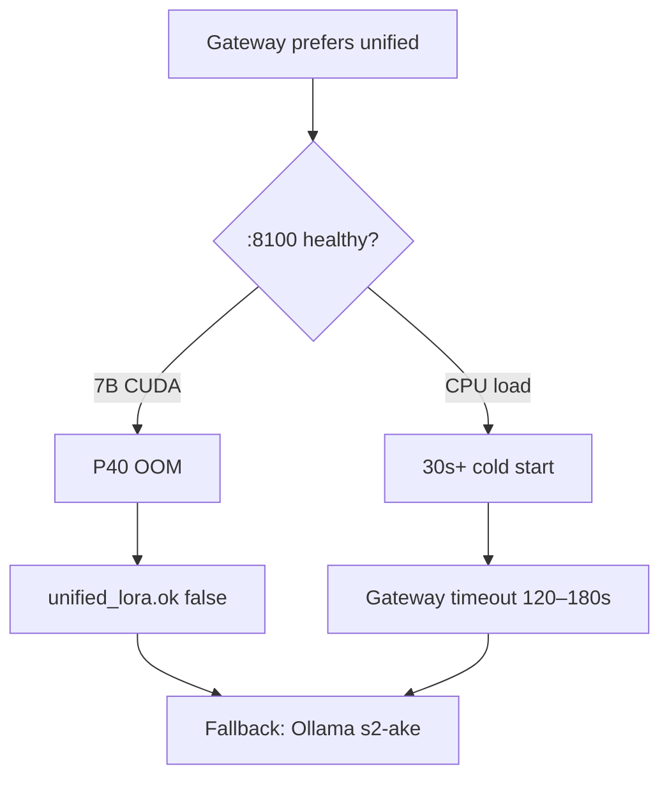

# r730 unified egregore — memory & device plan (Tesla P40)

**Host:** Proxmox r730 `192.168.1.78`  
**GPU:** Tesla P40 (24 GB VRAM, no bfloat16)  
**Service:** `unified-egregore` → `:8100`

---

## Modes

| Mode | Script | `EGREGORE_DEVICE` | `EGREGORE_USE_7B` | Hosted users |
|------|--------|-------------------|-------------------|--------------|
| **Production (default)** | `setup-unified-production-r730.sh` | `cpu` | `0` or `1`* | Use **Ollama**; unified optional lab |
| **Lab 7B CUDA** | `setup-unified-7b-r730.sh` | `cuda` | `1` | **OOM risk** — keep `HOSTED_PREFER_UNIFIED_LORA=false` |
| **Legacy GPT-2** | `setup-unified-8100-r730.sh` | `cpu` | `0` | BIPRA GPT-2 weights only |

\*Use 7B on CPU only for eval/benchmarks; expect 30s–120s per reply. Not for production hosted latency.

---

## Why unified LoRA often does not run



| Failure | Signal | Mitigation |
|---------|--------|------------|
| CUDA OOM | `journalctl -u unified-egregore` CUDA OOM | `setup-unified-production-r730.sh` → CPU |
| Slow CPU | `/health` ok but chat timeout | Raise `UNIFIED_EGREGORE_TIMEOUT_MS=300000` for lab only |
| Wrong weights | `hasAke: false` | Check `ADAPTERS_BASE=/mnt/bipra/egregore-training/trained_models` |
| Training holding GPU | Ollama works, unified fails | Wait for training end; restart service |

---

## Recommended production posture

```bash
# 1. Unified in safe CPU lab mode (for Tier C eval / benchmarks)
bash /opt/s2-ecosystem/public-api/scripts/setup-unified-production-r730.sh

# 2. Gateway: Ollama primary
grep HOSTED_PREFER_UNIFIED_LORA /opt/s2-ecosystem/public-api/.env
# → false

# 3. Ollama s2-ake always up
systemctl status ollama   # or your unit name
ollama list | grep s2-ake
```

---

## When to try CUDA 7B again

Only after:

- Tier C weights trained with grad checkpointing + measured peak VRAM < 22 GB, or
- 4-bit base load / QLoRA enabled in training stack, or
- Hardware upgrade (second GPU, A6000, etc.)

Experiment:

```bash
bash /opt/s2-ecosystem/public-api/scripts/setup-unified-7b-r730.sh
nvidia-smi
curl -s http://127.0.0.1:8100/health
python3 /opt/s2-ecosystem/public-api/scripts/tier-c-eval-gate-r730.py --skip-ollama
```

If OOM: immediately run `setup-unified-production-r730.sh`.

---

## Env tuning (gateway)

| Variable | Lab CPU | Production hosted |
|----------|---------|-------------------|
| `HOSTED_PREFER_UNIFIED_LORA` | `false` until Tier C gate | `false` (then `true`) |
| `UNIFIED_EGREGORE_TIMEOUT_MS` | `180000`–`300000` | `120000` if unified enabled |
| `UNIFIED_HEALTH_TIMEOUT_MS` | `60000` | `60000` |

Template: [scripts/r730-public-api.env](../scripts/r730-public-api.env)

---

## systemd drop-ins

| File | Purpose |
|------|---------|
| `unified-egregore.service.d/tier-ab.conf` | Persona off, greedy, `egregore_only` |
| `unified-egregore.service.d/7b-cuda.conf` | CUDA 7B — **remove** for production safe mode |
| (created by production script) `production-safe.conf` | CPU, `HOSTED_PREFER` stays false |

---

## Related

- [AKE_LORA_STATUS.md](./AKE_LORA_STATUS.md)
- [TIER_C_RETRAIN_RUNBOOK.md](./TIER_C_RETRAIN_RUNBOOK.md)
